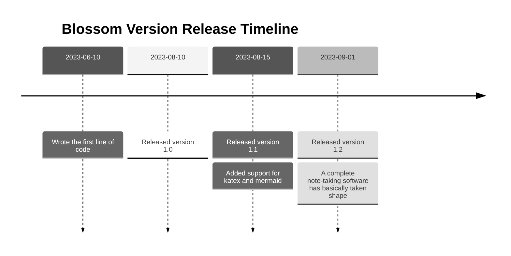

<script setup lang="ts">
import { onMounted } from 'vue'
import { info } from '../../scripts/stat-api'

onMounted(() => {
  info()
})
</script>

# 📑 Markdown Format Extensions

Markdown, being a document specification for plain text, has simple and easy-to-use syntax. However, its format is too basic, which is why many advanced editors opt for rich text development. Therefore, Blossom extends the Markdown format style through some conventions, allowing for richer visual effects and semantic expression in certain scenarios.

Many software applications on the market have rich formatting and custom syntax to help you write beautiful documents. However, many of these applications use proprietary formats. When you export a document as a Markdown file, it may not render correctly in other editors. **For example, native Markdown does not support the use of multiline code blocks within tables, but some editors may allow you to do so.** This is a non-compatible writing style, meaning you are bound by the editor, significantly increasing the difficulty and cost of migration.

So, Blossom's syntax extension is based on the native syntax, with additional formatting conventions. This is not a perfect solution, but it ensures that your Markdown displays correctly in any editor.

## Mind Map Support <Badge type="danger" text="Non-compatible Syntax" />{#markmap}

You can use Markdown headings to build mind maps. It is necessary to indicate the use of markmap rendering within a code block and then use Markdown syntax headings within the code block.

````markdown{1}
```markmap
# Blossom
## Article Editing
## Photo Wall (Image Hosting)
## To-Do List
## Calendar Plans
## Notes
```
````


The above Markdown content will be rendered as:

<bl-img src="../../imgs/article/markmap.svg" width="700px" height="300px" :shadow="false"/>

:::warning Note
Since mind maps are asynchronously rendered, they may cause preview page jitter. You can preset the content height using the following method to prevent page jitter. For example, set the maximum height of the mind map to 300 pixels:

````
```markmap##h300
```
````


:::

## Image Extensions {#image}

In Markdown, you cannot control the width and height of images. Usually, the displayed size of an image is the size of the image itself. Therefore, Blossom extends the functionality of images with the following features:

- Image width
- Adding shadows

For example, a regular image reference is as follows, and the image will be rendered as shown below:

<bl-img src="../../imgs/blossom/luban.png" width="300px" :shadow="false"/>

```markdown

```

---

<bl-img src="../../imgs/blossom/luban.png" width="200px" :shadow="false"/>

If you want to control the width of the image, you can add `##w200##` after the image name, and the width of the image will be 200 pixels.

```markdown

```

:::tip Tip
The width can be a percentage. Just add a percentage sign `%` at the end of `w200` (invalid if exceeding 100%). If no percentage sign is added, the default unit is pixels (px).
:::

---

<bl-img src="../../imgs/blossom/luban.png" width="200px" />

If you want to add a shadow to the image, you can add `##shadow##` after the image name.

```markdown

```

:::tip Tip
In Blossom, all images have a 4-pixel border radius.
:::

## Video Extensions <Badge type="danger" text="Non-compatible Syntax" />{#video}

The video function is an extension based on multiline code blocks. Currently, the supported video sources are as follows:

1. `bilibili`

Usage is as follows:

````
```bilibili##BV1vp4y1G7uj##w100%##h300
```
````

Parameter Explanation:

- `bilibili`: Resolves to a `bilibili` video, must be the first parameter.
- `bvid`: Video `bvid`, must be the second parameter.
- `w100%`: Video width is `100%`. If the width does not end with %, it will be calculated in pixels. If no width is specified, it defaults to 100%.
- `h300`: Video height is `300` pixels. Height cannot be a percentage. If no height is specified, it defaults to 300 pixels.

The above video will be parsed as:

<div style="width: 100%">
  <iframe
    width="100%"
    height="400px"
    scrolling="no"
    border="0"
    frameborder="no"
    framespacing="0"
    src="https://player.bilibili.com/player.html?bvid=BV1vp4y1G7uj&page=1&autoplay=0"></iframe>
</div>

## Multi-Color Blockquotes {#blockquote}

<bl-blockquote color="blue">Quotes can specify colors. For example, the usage of the blue blockquote containing this text is as follows</bl-blockquote>

```
> ##blue##
> You can specify the color of the quote by using ##color## above.
```

Currently, 7 colors are supported:

<bl-blockquote >Default</bl-blockquote>

<bl-blockquote color="black">Black ##black##</bl-blockquote>

<bl-blockquote color="green">Green ##green##</bl-blockquote>

<bl-blockquote color="yellow">Yellow ##yellow##</bl-blockquote>

<bl-blockquote color="red">Red ##red##</bl-blockquote>

<bl-blockquote color="blue">Blue ##blue##</bl-blockquote>

<bl-blockquote color="purple">Purple ##purple##</bl-blockquote>

Blockquotes also support the use of [GitHub syntax semantic quotes](https://github.com/orgs/community/discussions/16925).

```
> [!NOTE]
> Highlights information that users should take into account, even when skimming.

> [!TIP]
> Optional information to help a user be more successful.

> [!IMPORTANT]
> Crucial information necessary for users to succeed.

> [!WARNING]
> Critical content demanding immediate user attention due to potential risks.

> [!CAUTION]
> Negative potential consequences of an action.
```

The above content will be rendered as follows:

<bl-blockquote color="blue">Highlights information that users should take into account, even when skimming.</bl-blockquote>

<bl-blockquote color="blue">Optional information to help a user be more successful.</bl-blockquote>

<bl-blockquote color="purple">Crucial information necessary for users to succeed.</bl-blockquote>

<bl-blockquote color="yellow">Critical content demanding immediate user attention due to potential risks.</bl-blockquote>

<bl-blockquote color="red">Negative potential consequences of an action.</bl-blockquote>

## Table Layout {#table}

You can use tables as layout tools. Simply fill in `##container##` in the table header, and the table will hide the header and border. For example:

```markdown
| ##container## | The header will be hidden |
| ------------- | ------------------------ |
| column 1      | column 2                 |
```

The table will be rendered as:

<div style="width: 100%;">
  <div style="display:inline-block;width: 50%; ">column 1</div>
  <div style="display:inline-block;width: 50%; ">column 2</div>
</div>

:::warning Note
Markdown table functionality is relatively simple. If you need to write complex content within a table, it is recommended to use the `Html + Style` method.

Most local Markdown editors support native Html content, but for security reasons, some cloud storage editors may not support parsing Html content.
:::

Here is a usage example that the author often uses:

```markdown
|                       ##container##                       |
| :-------------------------------------------------------: |
|  |
|            **This is a silly cat I picked up**, it's called Luban             |
|             It went from **5** kg to **15** kg by itself!             |
|                     But I really like it 😸                     |
```

The content above will be rendered as:

<bl-img src="../../imgs/blossom/luban.png" width="150px" />
<div style="width: 100%;display:flex;flex-direction: column;align-items: center;margin-top:10px;">
  <div style="display:inline-block;width: 100%; text-align:center;"><span style="font-weight: bold;">This is a silly cat I picked up</span>, it's called Luban</div>
  <div style="display:inline-block;width: 100%; text-align:center;">It went from <span style="font-weight: bold;">5</span> kg to <span style="font-weight: bold;">15</span> kg by itself</div>
  <div style="display:inline-block;width: 100%; text-align:center;">But I really like it 😸</div>
</div>

## Double-Linked References {#references}

Please refer to [Article Editing](./article#references).

## Katex Math Formulas <Badge type="danger" text="Non-compatible Syntax" />{#katex}

Math formulas rely on [Katex](https://github.com/KaTeX/KaTeX).

### Inline Formulas {#katex-inline}

Inline formulas extend on single-line code blocks. You need to write Katex syntax within `$$`. For example:

```markdown
Supports inline formulas, for example: The energy equation $E = mc^2$ is an elegant and great formula.
```

The above text will be rendered as:

<bl-img src="../../imgs/article/katex_inline.png" width="450px" :shadow="false"/>

### Non-inline Formulas {#katex-block}

Non-inline formulas support the official `$$` syntax and also support filling in Katex after the triple backticks to specify that the code block content is Katex syntax, as follows:

````
$$
\left\{ \begin{array}{l}
0 = c_x-a_{x0}-d_{x0}\dfrac{(c_x-a_{x0})\cdot d_{x0}}{\|d_{x0}\|^2} + c_x-a_{x1}-d_{x1}\dfrac{(c_x-a_{x1})\cdot d_{x1}}{\|d_{x1}\|^2} \\[2ex]
0 = c_y-a_{y0}-d_{y0}\dfrac{(c_y-a_{y0})\cdot d_{y0}}{\|d_{y0}\|^2} + c_y-a_{y1}-d_{y1}\dfrac{(c_y-a_{y1})\cdot d_{y1}}{\|d_{y1}\|^2} \end{array} \right.
$$

---

# In some editors, formulas can be edited in the following way
```katex
\begin{CD}
  RCOHR'SO_3Na @>{\text{Hydrolysis,$\Delta, Dil.HCl$}}>> (RCOR')+NaCl+SO_2+ H_2O
\end{CD}
```
````

The two formulas in the above Markdown content will be rendered as follows:

<bl-img src="../../imgs/article/katex_block.png" width="550px" :shadow="false"/>

## Mermaid Charts <Badge type="danger" text="Non-compatible Syntax" />{#mermaid}

Mermaid charts extend on multiline code blocks. After the triple backticks, fill in mermaid to specify that the code block content is Mermaid syntax, as follows:

````

````

The above Markdown content will be rendered as:

<bl-img src="../../imgs/article/mermaid.png" width="700px" :shadow="false"/>

:::warning Note
Since charts are asynchronously rendered, they may cause preview page jitter. You can preset the content height using the following method to prevent page jitter. For example, set the maximum height of the chart to 300 pixels:

````
```mermaid##h300
```
````

:::
