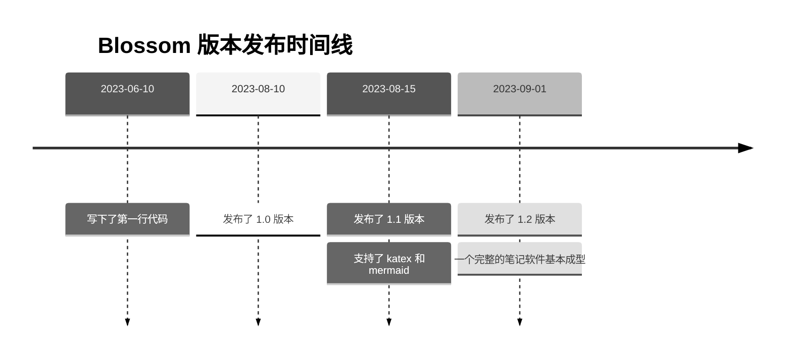

<script setup lang="ts">
import { onMounted } from 'vue'
import { info } from '../scripts/stat-api'

onMounted(() => {
  info()
})
</script>

# 📑 Markdown 格式拓展

Markdown 由于是一个纯文本格式的文档规范，它语法简单易用，但格式却过于简单，这也是为什么很多复杂的编辑器都采用富文本的方式进行开发。所以 Blossom 在 Markdown 的语法基础上，通过一些约定来拓展 Markdown 的格式样式。让在一些场景下有更丰富的视觉效果和语义表达。

市面上的软件都具有丰富的格式和自定义语法，可以帮助你编写美观的文档，但这些应用很多是私有格式的，当你导出为 Markdown 文件后，在其他编辑器中可能无法正常渲染。**例如原生 Markdown 是不支持表格中使用多行代码块的，但有些编辑器可能允许你这么做**，这是一种不兼容的写法，意味着你会被编辑器所绑架，这大大增加了迁移的难度和成本。

所以 Blossom 的语法拓展是在原生语法之上进行格式约定，这不是完美的解决方案，但是可以让你的 Markdown 在任何编辑器中都能正常显示。

## 思维导图支持 <Badge type="danger" text="非兼容语法" />{#markmap}

可以使用 Markdown 标题来构建思维导图。需要在代码块中表明使用 markmap 渲染，然后在代码块内使用 markdown 语法的标题即可。

````markdown{1}
```markmap
# Blossom
## 文章编辑
## 照片墙(图床)
## 待办事项
## 日历计划
## 便签
```
````

上述 Markdown 内容将被渲染成：

<bl-img src="../imgs/article/markmap.svg" width="700px" height="300px" :shadow="false"/>

## 图片拓展 {#image}

Markdown 中的图片是无法控制宽高的，通常图片的显示大小就是图片本身的大小，所以 Blossom 拓展了图片的如下功能：

- 图片宽度
- 增加阴影

例如：一个普通的图片引用如下，该图片会被渲染为下图

<bl-img src="../imgs/blossom/luban.png" width="300px" :shadow="false"/>

```markdown

```

---

<bl-img src="../imgs/blossom/luban.png" width="200px" :shadow="false"/>

如果你想控制图片的宽度，可以在图片名称后增加`##w200##`，图片的宽度就为 200 像素。

```markdown

```

:::tip 提示
宽度可以是百分比，只需要在 w200 末尾增加百分号%即可(超过 100%无效)，如果不加百分号，则默认单位为像素(px)。
:::

---

<bl-img src="../imgs/blossom/luban.png" width="200px" />

如果你想为图片增加阴影，可以在图片名称后增加`##shadow##`。

```markdown

```

:::tip 提示
在 Blossom 中，所有的图片都是 4 像素圆角的
:::

## 视频拓展 <Badge type="danger" text="非兼容语法" />{#video}

视频功能是在多行代码块的基础上拓展的，目前支持的视频源如下

1. `bilibili`

使用方式如下

````
```bilibili##BV1vp4y1G7uj##w100%##h300
```
````

参数说明

- `bilibili`: 解析为 `bilibili` 视频，必须为第一个参数。
- `bvid`: 视频 `bvid`，必须为第二个参数。
- `w100%`: 视频宽度为 `100%`, 如果宽度不以 % 结尾, 则会以像素计算. 如果未指定宽度, 则为 100%
- `h300`: 视频宽度为高度为 `300` 像素, 高度不能为百分比. 如果未指定高度, 则为 300 像素

上面的视频将被解析为：

<div style="width: 100%">
  <iframe
    width="100%"
    height="400px"
    scrolling="no"
    border="0"
    frameborder="no"
    framespacing="0"
    src="https://player.bilibili.com/player.html?bvid=BV1vp4y1G7uj&page=1&autoplay=0"></iframe>
</div>

## 多色引用块 {#blockquote}

<bl-blockquote color="blue">引用可以指定颜色, 例如该文本所在的蓝色引用块的使用方式如下</bl-blockquote>

```
> ##blue##
> 可以在上方使用##颜色##的方式指定引用的颜色
```

目前支持 7 种颜色

<bl-blockquote >默认</bl-blockquote>

<bl-blockquote color="black">黑色 ##black##</bl-blockquote>

<bl-blockquote color="green">绿色 ##green##</bl-blockquote>

<bl-blockquote color="yellow">黄色 ##yellow##</bl-blockquote>

<bl-blockquote color="red">红色 ##red##</bl-blockquote>

<bl-blockquote color="blue">蓝色 ##blue##</bl-blockquote>

<bl-blockquote color="purple">紫色 ##purple##</bl-blockquote>

引用快还支持使用 Github 语法的语义化引用。

```
> [!NOTE]
> Highlights information that users should take into account, even when skimming.

> [!IMPORTANT]
> Crucial information necessary for users to succeed.

> [!WARNING]
> Critical content demanding immediate user attention due to potential risks.
```

上述内容将会渲染成如下内容：

<bl-blockquote color="blue">Highlights information that users should take into account, even when skimming.</bl-blockquote>

<bl-blockquote color="purple">Crucial information necessary for users to succeed.
</bl-blockquote>

<bl-blockquote color="yellow">Critical content demanding immediate user attention due to potential risks.</bl-blockquote>

## 表格布局 {#table}

可以使用表格充当布局工具，只需要在表头中填写 ##container##, 那么表格将不显示头部以及边框, 例如：

```markdown
| ##container## | head 将会被隐藏 |
| ------------- | --------------- |
| column 1      | column2         |
```

表格将会渲染成

<div style="width: 100%;">
  <div style="display:inline-block;width: 50%; ">column 1</div>
  <div style="display:inline-block;width: 50%; ">column 2</div>
</div>

:::warning 注意
Markdown 的表格功能是较为简单的，如果你要在表格内编写复杂内容，建议使用 `Html + Style` 的方式。

大多数本地 Markdown 编辑器是支持 Html 原生内容的，但一些云端存储的编辑器出于安全考虑，可能不支持解析 Html 内容。
:::

下面是作者常用的一种用法:

```markdown
|                       ##container##                       |
| :-------------------------------------------------------: |
|  |
|            **这是我捡到的一只蠢猫**, 它叫鲁班             |
|             它把自己从**5** 斤吃到了**15**斤!             |
|                     但是我很喜欢它 😸                     |
```

上方的内容将被渲染成

<bl-img src="../imgs/blossom/luban.png" width="150px" />
<div style="width: 100%;display:flex;flex-direction: column;align-items: center;margin-top:10px;">
  <div style="display:inline-block;width: 100%; text-align:center;"><span style="font-weight: bold;">这是我捡到的一只蠢猫</span>, 它叫鲁班</div>
  <div style="display:inline-block;width: 100%; text-align:center;">它把自己从<span style="font-weight: bold;">5</span>斤吃到了<span style="font-weight: bold;">15</span>斤</div>
  <div style="display:inline-block;width: 100%; text-align:center;">但是我很喜欢它 😸</div>
</div>

## 双链引用{#references}

该部分请查阅[文章编辑](./article#references)。

## Katex 数学公式 <Badge type="danger" text="非兼容语法" />{#katex}

数学公式依赖于 [Katex](https://github.com/KaTeX/KaTeX)。

### 行内公式 {#katex-inline}

行内公式在单行代码块的基础上进行拓展，你需要在 `$$` 内部书写 katex 语法，如下：

```markdown
支持行内公式, 例如: 质能方程 `$E = mc^2$` 是一个优雅而伟大的公式
```

上述文字将被渲染成下图：

<bl-img src="../imgs/article/katex_inline.png" width="450px" :shadow="false"/>

### 非行内公式 {#katex-block}

非行内公式在代码块的基础上进行拓展，在```后填写 katex，来指定代码块内容为 Mermaid 语法，如下:

````
```katex
\left\{ \begin{array}{l}
0 = c_x-a_{x0}-d_{x0}\dfrac{(c_x-a_{x0})\cdot d_{x0}}{\|d_{x0}\|^2} + c_x-a_{x1}-d_{x1}\dfrac{(c_x-a_{x1})\cdot d_{x1}}{\|d_{x1}\|^2} \\[2ex]
0 = c_y-a_{y0}-d_{y0}\dfrac{(c_y-a_{y0})\cdot d_{y0}}{\|d_{y0}\|^2} + c_y-a_{y1}-d_{y1}\dfrac{(c_y-a_{y1})\cdot d_{y1}}{\|d_{y1}\|^2} \end{array} \right.
```

---

```katex
\begin{CD}
  RCOHR'SO_3Na @>{\text{Hydrolysis,$\Delta, Dil.HCl$}}>> (RCOR')+NaCl+SO_2+ H_2O
\end{CD}
```
````

上述 Markdown 内容中的两个公式将被渲染成下图:

<bl-img src="../imgs/article/katex_block.png" width="550px" :shadow="false"/>

## Mermaid 图表 <Badge type="danger" text="非兼容语法" />{#mermaid}

非行内公式在代码块的基础上进行拓展，在```后填写 mermaid，来指定代码块内容为 Mermaid 语法，如下:

````

````

上述 Markdown 内容将被渲染成下图:

<bl-img src="../imgs/article/mermaid.png" width="700px" :shadow="false"/>
